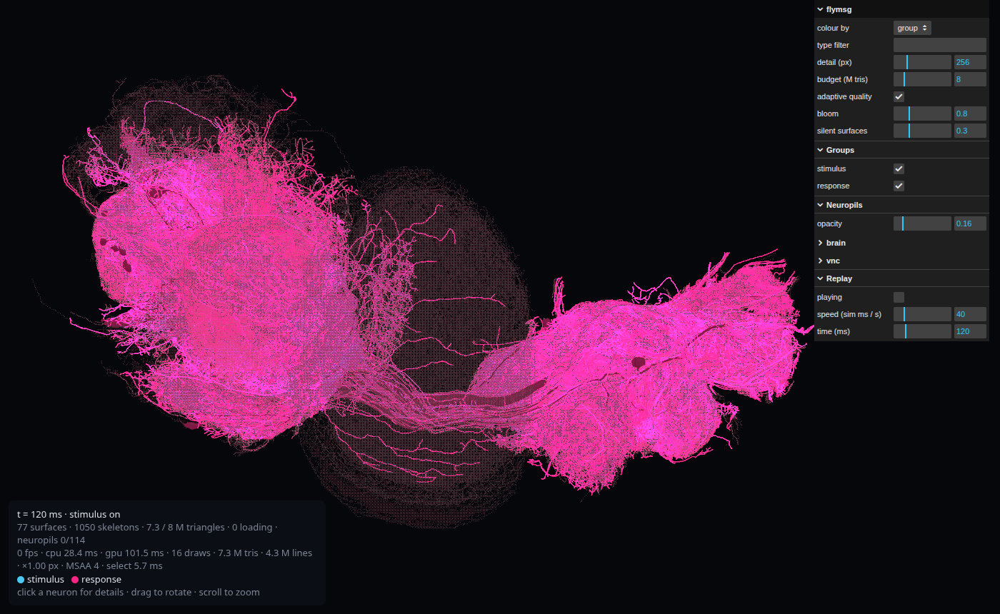

# flymsg

[](https://github.com/gianlucamazza/flymsg/actions/workflows/tests.yml)
[](LICENSE)

Simulate and view in 3D the first complete central nervous system of a male fruit fly:
[MaleCNS v1.0](https://male-cns.janelia.org/) (Janelia FlyEM + Google, CC-BY 4.0), with
165,122 traced neurons, 25.6 M connections and 124 M synapses across the brain, optic lobes
and ventral nerve cord.

flymsg turns the wiring diagram into a spiking network, checks the simulation against
circuits whose function is known from experiments, and streams the real neuron shapes into a
browser to replay the activity.



## What it does

- **Explore the wiring**: annotations and partners of any cell type (`info`); the strongest
  chain between two cell types, plus alternative routes (`path`).
- **Simulate**: a whole-CNS leaky integrate-and-fire model after Shiu et al.
  (_Nature_ 2024) (`sim`). On the same connectome the engine reproduces their published
  brian2 model within noise.
- **Validate**: a battery of known circuits with controls, dose-response and latency-order
  checks (`validate`). Model choices go through pre-registered rules (`calibrate`,
  `select-model`).
- **Ask questions about sex differences**: how much simulated responses run through
  dimorphic neurons, and what silencing them does (`dimorphism`); the same model on the
  female FlyWire brain (`--dataset fafb`).
- **See it**: a three.js page streams source-resolution neuron surfaces, skeletons and
  neuropils from the public data, and replays the simulated activity (`viz`).

## Results so far

- **The model passes every validation check with no compensation** (29/29, criterion v4).
  The cases are looming escape (LC4 → Giant Fiber → jump motor neuron), Giant Fiber output,
  P1 courtship drive and the pIP10 song pathway, sugar → proboscis motor neuron MN9, and
  bitter taste leaving MN9 silent. The only departure from the published model is a synapse
  weight scaled for MaleCNS's denser synapse detection, chosen by a pre-registered model
  selection and confirmed on fresh seeds ([validation](docs/validation.md)).
- **The engine matches the published model.** On the female FlyWire brain, with the same
  sugar neurons, flymsg and Shiu et al.'s brian2 code agree within noise (r ≥ 0.998 over all
  active neurons). The check uncovered six places where an earlier version of flymsg had
  departed from the published model ([comparison](docs/comparison.md#engine-check)).
- **Courtship circuits run through the dimorphic network; escape and feeding do not.**
  Responders to P1 and pIP10 stimulation are 4–19× enriched in fru/dsx+, male-specific and
  dimorphic neurons over superclass-matched chance. Two pre-registered silencing tests with
  1,000 matched null draws each then asked what is necessary: silencing the 948 sexually
  dimorphic neurons raises the song neuron dPR1 by 61–64 % after either stimulus (confirmed),
  and silencing the two dMS9 neurons alone raises it by two thirds, more than silencing any
  matched active neurons. The same tests reject the other half of v0.5's prediction: the
  inhibitory neurons vPR9_a and IN00A038 are not the route by which dMS9 holds dPR1 back
  ([dimorphism](docs/dimorphism.md)).
- **Synapse counts are not comparable across datasets.** A male neuron has a median 1.81× the
  synapses of its female counterpart over 7,327 matched cell types, a difference between the
  reconstructions. Male vs female simulations are corrected for it
  ([comparison](docs/comparison.md)).
- **Part of the published sugar response comes from LB3d-like taste neurons**, a subtype one
  study matched to high-salt receptor lines. In the female model the "sugar" set of Shiu et
  al. splits into 14 sugar-like and 6 LB3d-like neurons; the latter add about a quarter of
  the MN9 response.

Negative results are kept as well: the [findings log](docs/validation.md#findings-log)
records what failed and why.

## Quick start

Requires [uv](https://docs.astral.sh/uv/) (Python 3.13) and, for the browser tests, Node ≥ 22 (CI: Node 24).

```bash
git clone https://github.com/gianlucamazza/flymsg && cd flymsg
uv sync
uv run flymsg fetch     # ~1.1 GB of public Feather tables into data/raw/, no account needed
uv run flymsg build     # compact to data/*.parquet (~10 s)

uv run flymsg path LC4 TTMn --alt 3
uv run flymsg sim LC4_R --duration 600 --stim-ms 300 --seeds 3 --superclass descending_neuron vnc_motor
uv run flymsg viz --sim LC4_R && python -m http.server -d runs/viz 8000   # open http://localhost:8000
```

Neurons are addressed by cell type (`LC4`), instance (`LC4_R`) or bodyId (`10001`). The data
directory defaults to `./data` (`--data DIR` or `FLYMSG_DATA` to change it).

## Commands

| Command                                                         | What it does                                                                                            |
| --------------------------------------------------------------- | ------------------------------------------------------------------------------------------------------- |
| `compare [--sex \| --fingerprint TYPE… \| --lb3-split]`         | male vs female: synapse density, the same model on both, the FAFB LB3 split                             |
| `fetch`, `build`                                                | download and compact the connectome (`--dataset fafb` for the female brain, ~135 MB)                    |
| `info TYPE`                                                     | annotations, top partner types, Neuroglancer link                                                       |
| `path SRC DST [--alt K]`                                        | strongest chain by input fraction; `--alt` adds routes avoiding the previous intermediate types         |
| `sim STIM…`                                                     | simulate a Poisson stimulus; per-type rates, reliability across seeds, latency, self-sustained activity |
| `validate`                                                      | the validation battery (a few minutes)                                                                  |
| `calibrate`, `select-model`                                     | parameter grid search and pre-registered model comparison                                               |
| `audit`                                                         | reconstruction completeness: flags bilateral neurons with one side far below the other                  |
| `dimorphism [--silencing \| --loop \| --by-type CASE CATEGORY]` | dimorphic neurons among responders; silencing by category, by cell type, or of the predicted dMS9 loop  |
| `viz --sim STIM \| --path SRC DST \| --types …`                 | export a 3D scene; the page streams geometry from the public volumes                                    |

The 3D page takes URL options such as `?t=<ms>&paused`, `?color=dimorphism`, `?detail=`,
`?adaptive=0`,
`?neuropils=0|1`, `?budget=<M triangles>` and `?bench=<s>` ([viz](docs/viz.md)).

## How it works

1. **Data.** The MaleCNS tables list every traced neuron with its annotations (cell type,
   predicted transmitter, sex-related labels) and every connection with its synapse count.
   flymsg keeps the 165,122 traced neurons and the connections among them
   ([data](docs/data.md)).
2. **Model.** Each neuron is a leaky integrate-and-fire unit. A connection of _n_ synapses
   adds ±*n* · `w_syn` to its target after 1.8 ms. The sign follows the presynaptic
   transmitter: acetylcholine excites; GABA, glutamate and histamine inhibit; modulators have
   no fast effect. Stimulated neurons receive Poisson input spikes. All parameters are Shiu
   et al.'s, except `w_syn`, which is divided by the synapse-density factor
   ([model](docs/model.md)).
3. **Validation.** Each case stimulates a population and checks the expected target:
   - it fires reliably;
   - it fires far more than when the same number of random, similar neurons is stimulated;
   - it responds more to stronger input;
   - successive stages fire in order;
   - activity dies out after the stimulus.
4. **Rules before results.** Criteria, calibrations and model selections are written down in
   [validation](docs/validation.md) before they run, and a failure is recorded rather than
   tuned away.
5. **3D view.** The export holds only metadata and activity. The page reads the public
   multi-resolution meshes and skeletons directly from Google Cloud Storage, refining detail
   near the camera within a triangle budget ([viz](docs/viz.md)).

## Limits

- **One animal per dataset.** There is no measure of individual variability, and sex
  differences cannot be separated from reconstruction differences. `flymsg audit` flags
  incompletely reconstructed bilateral neurons (3.2 % of types, including MN9_R).
- **Wiring only.** No gap junctions, neuromodulation, plasticity or cell-specific properties;
  transmitters are machine predictions. The Giant Fiber, for example, behaves like a
  _shak-B²_ mutant lacking its electrical synapse.
- **Qualitative rates.** Use the model to rank which circuits a stimulus recruits and in what
  order, not to predict exact firing.
- **Few, short cases.** The validation cases are mostly 1–2-hop feed-forward chains.

## Documentation

| Document                         | Content                                                                     |
| -------------------------------- | --------------------------------------------------------------------------- |
| [data](docs/data.md)             | sources, files, filtering, schema, the female FAFB dataset, citations       |
| [model](docs/model.md)           | equations, parameters and their origin, synapse signs, density scaling      |
| [validation](docs/validation.md) | current status, protocol, cases, calibration, model selection, findings log |
| [comparison](docs/comparison.md) | engine check against the published model, male vs female, the LB3 split     |
| [dimorphism](docs/dimorphism.md) | dimorphic neurons among responders, silencing                               |
| [viz](docs/viz.md)               | 3D pipeline, levels of detail, rendering quality, GPU measurements          |
| [CHANGELOG](CHANGELOG.md)        | what changed in each version                                                |

## Development

```bash
uv run pytest            # unit tests on synthetic networks + browser-module tests (node --test)
uv run pytest -m slow    # plus the full validation battery (needs the data) and a live GCS read
uv run ruff check && uv run ruff format --check src tests scripts
```

- `tests/reference_sim.py` keeps the previous NumPy simulator as an oracle: the compiled
  kernel must reproduce its spikes exactly.
- `scripts/shiu_reference.py` runs the published brian2 model for the engine check. It needs
  brian2 in its own environment.
- `scripts/shoot.mjs` screenshots the 3D view headless (`GL=gl` for the real GPU).
- `scripts/vendor-js.sh` refreshes the vendored three.js and lil-gui.

## Citation

If you use flymsg, cite the data and the model it builds on (see also
[CITATION.cff](CITATION.cff)):

- MaleCNS: Berg, S. et al. Sexual dimorphism in the complete _Drosophila_ male central
  nervous system connectome. _Cell_ 189, 5504–5526 (2026). doi:10.1016/j.cell.2026.08.015.
  CC-BY 4.0.
- Model: Shiu, P. K. et al. A _Drosophila_ computational brain model reveals sensorimotor
  processing. _Nature_ 634, 210–219 (2024). doi:10.1038/s41586-024-07763-9
- For `--dataset fafb`: FlyWire (Dorkenwald et al. 2024; Schlegel et al. 2024; Matsliah et
  al. 2024; Berg et al., the MaleCNS paper above), as listed in [data](docs/data.md).

## License

Code: [MIT](LICENSE). The connectome data are not part of this repository; they are
downloaded from their public sources under their own licences. Vendored three.js and lil-gui
are MIT (`src/flymsg/viz_static/vendor/`).
